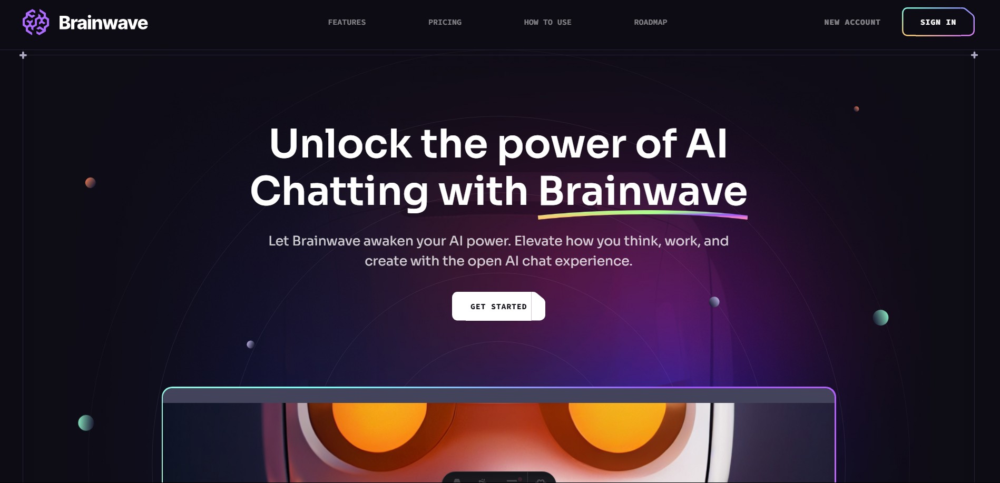

# 🧠 Brainwave

**Brainwave** is a practice-based landing page project built with **Astro**, **React**, **Tailwind CSS**, and **TypeScript**. The goal of this project is to improve my frontend development skills by focusing on clean structure, animation, responsive design, and performance optimization.

## 🚀 Project Goals

- Practice building modern layouts using semantic HTML and utility-first CSS.
- Integrate React components within an Astro project.
- Implement smooth, high-performance animations.
- Learn best practices for accessibility, SEO, and web performance.

## 🛠️ Tech Stack

- [Astro](https://astro.build/) – Static site generator with modern performance.
- [React](https://reactjs.org/) – For dynamic and reusable UI components.
- [Tailwind CSS](https://tailwindcss.com/) – Utility-first styling framework.
- [TypeScript](https://www.typescriptlang.org/) – Static typing for better dev experience.

## 🧪 Project Status

🟡 **In progress** — actively developing UI components, animations, and page sections.

## 📚 Learning Outcomes

- How to structure a hybrid Astro + React + TypeScript project.
- Improved layout and responsive design skills with Tailwind.
- Performance-first approach to building landing pages.

---

Feel free to clone or explore this project as inspiration for your own landing pages.
